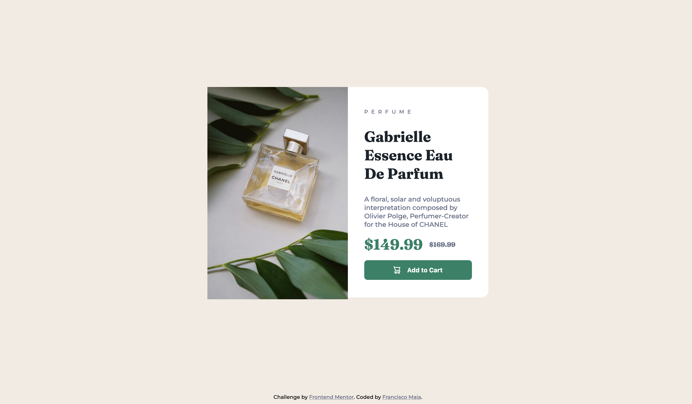

# Frontend Mentor - Product preview card component solution

This is a solution to the [Product preview card component challenge on Frontend Mentor](https://www.frontendmentor.io/challenges/product-preview-card-component-GO7UmttRfa). Frontend Mentor challenges help you improve your coding skills by building realistic projects. 

## Table of contents

- [Overview](#overview)
  - [Screenshot](#screenshot)
  - [Links](#links)
- [My process](#my-process)
  - [Built with](#built-with)
  - [What I learned/practiced](#what-i-learned/practiced)
  - [Continued development](#continued-development)
  - [Useful resources](#useful-resources)
- [Author](#author)

## Overview

### Screenshot



### Links

- Solution URL: [Add solution URL here](https://xico26.github.io/fm-product-preview-card)

## My process

### Built with

- Semantic HTML5 markup
- CSS custom properties
- Flexbox
- CSS Grid
- Media Queries

### What I learned/practiced

- The HTML Picture Element

```html
  <picture>
    <source media="(max-width:768px)" srcset="/images/image-product-mobile.jpg">
    
  </picture>
```

- HTML Landmarks (main, footer)


### Useful resources

- [Picture Element on MDN](https://developer.mozilla.org/en-US/docs/Web/HTML/Element/picture) - How to use the picture element

## Author

- Website - [Francisco Maia](https://xico26.github.io)
- Frontend Mentor - [@Xico26](https://www.frontendmentor.io/profile/Xico26)
